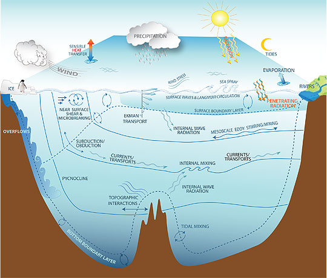

# 探秘数据同化：大气海洋科学中的信息融合与精准预测

*河海大学，海洋学院，沈浙奇*

在我们的日常生活中，我们经常能够观察到不同元素或事物之间相互影响和融合，从而逐渐使它们趋向相似或相近的现象。这一现象被称为“同化”，它在文化、社会乃至生物体内都有显著体现。以文化多样性为例，不同国家、地区的人们在饮食、服饰、语言等方面都展现出独特特点。然而，随着全球化进程的不断推进，人们之间的交流与互动显著增加，从而引发不同文化逐渐相互渗透，导致一些文化特征逐步同化，即向一致方向演变。我们在不同城市都能见到的大同小异的商圈、美食、快餐文化和网红景点，都是这一现象的具体体现。

 “同化”一词常指一个事物或个体逐渐融合入或被吸收至另一事物或个体中，以使它们的相似性或同一性逐渐增强。例如，当大学生融入新的集体环境时，尽管一开始可能感到不适应，但随着时间推移和大学生活的深入，逐渐改变的生活习惯、兴趣爱好、思维方式甚至语言表达，使得他们在毕业时展现出所在集体独有的特质。这种属性有时被称作班级氛围、校园文化或大学生气质。在这一过程中，我们常用“同化”来形容这名学生在集体中逐渐融入的变化。

类似的“同化”概念在大气海洋科学中也有体现，即数据同化（Data assimilation，也称资料同化），它被定义为一种融合多源数据的方法。在大气和海洋科学中，我们面临着大量来自卫星、浮标、传感器等各种设备的观测数据，记录了地球不同地点和时间的气象和海洋状况。然而，这些数据可能受到噪声、缺失或不完整性的影响。另一方面，数值模型是人类智慧的结晶，这些模型利用计算机求解数学物理方程，可以得到大量数据以模拟现实世界中的物理现象。

在数据同化的背后，蕴藏着一种朴素的思想：我们试图将观测数据与数值模型结合，以获取更准确、更全面的信息。这个过程类似于日常生活中的文化融合，不同之处在于我们融合的是数据和模型，目的是获取精确的科学预测（图1）。

> *图1. 在大气海洋科学中，数据同化指的是将观测数据与数值模型结合，以获取更准确、更全面的信息的一个过程。*

数据同化的概念起源于数值天气预报领域，最初旨在为大气数值模型提供可靠的初始条件。自20世纪40年代起，科学家们开始运用计算机模拟大气运动，首次尝试以数值方法求解描述大气运动规律的物理方程，从而预测未来的天气变化。使用数值计算方法求解的微分方程就是所谓的数值模型（也称“数值模式”）。实际上，无论是短期的天气预报还是长期的气候预测，都可视为在给定初始条件下对数值模型的积分。因此，天气和气候预报均可以被视为初值问题，初始条件的准确性对预报结果具有深远影响。这种影响一个比喻就是“蝴蝶效应”，即蝴蝶在巴西的振翅可能引发美国得克萨斯州的龙卷风。在复杂的天气系统中，微小初始变化可能引发系统内部的连锁反应，从而导致无法预测的重大后果。因此，准确的初始条件对预报效果至关重要。

20世纪的大气观测技术不断进步，气象卫星、雷达技术以及探空观测的发展，为科学家提供了更多、更精确的气象数据，为气象研究和天气预报的改进提供了坚实基础。因此，在20世纪后半叶，随着数据收集技术的改进，数据同化技术被提出来并应用于天气预报。数据同化通过将观测与数值模型结合，为模型提供更可靠的初始条件，进一步提升了天气预报的准确性。近几十年来数值天气预报的迅速发展很大程度上得益于数据同化技术的发展（图2）。作为一种有效融合观测数据与数值模型的技术，数据同化对于提高天气预报的准确性、时效性和可靠性起到了至关重要的作用。

> *图2.* *以热带以外的北半球和南半球计算的三天、五天、七天和十天的预报技巧。预报技巧是在500百帕高度层上的预报和用于验证的分析场各自对气候平均高度的异常之间的相关性。超过60%的数值表示可用的预报，超过80%的数值表示准确度很高。1999年之后北半球和南半球曲线的收敛是由于使用变分方法处理卫星资料带来的突破。*

除了改善初始条件外，数据同化还有其他几个应用方面。例如，数据同化可通过观测数据来估计和约束数值模型的参数。由于科学认知和技术限制，许多数值模型的物理参数是经验或半经验性的，存在较大的不确定性。特别是在数值模型的分辨率无法刻画一些小尺度过程时，需要引入参数化方案来描述物理过程。而一些复杂的动力过程，如涡旋、湍流、海洋垂直混合等，也需引入参数化方案以弥补目前对其认知的限制（图3）。数据同化可以借助观测数据来优化估计这些参数，减小其不确定性，这一过程被称为参数估计。

> *图3. 海洋中的小尺度混合过程示意图 (引自：http://www.gfdl.noaa.gov/ocean-mixing)*

此外，数据同化还能通过分析和吸收特定变量（如海洋温度）的观测数据，提升数值模型的整体模拟能力。这使得即便在没有观测数据支持的网格点上，也能获得高质量的状态估计，这一过程被称为数据同化再分析。当前，许多再分析产品作为观测数据的替代品已广泛应用，如美国国家环境预报中心的再分析数据集（NCEP Reanalysis Dataset）和美国国家环境信息中心的海洋再分析产品（GODAS）等。

正如前面介绍的，数据同化起源于大气科学中的数值天气预报。除了大气科学，数据同化迅速在其他地球科学领域得到应用，如海洋科学、陆地表层科学和固体地球等。当下，数据同化已经成为地球系统科学各分支领域通用的方法论。

在海洋科学中，数据同化的发展稍晚，但发展迅速。这要归功于一系列观测技术的创新发展，如卫星观测、海洋浮标和阵列技术，以及国际合作项目的推动，如ARGO国际观测网络和GOOS全球海洋观测系统。随着数据量的增加，适用于海洋数值模型的同化方法也得到相应的提升。近30年来，广泛应用的数据同化方法之一——集合卡尔曼滤波器（EnKF）就是在海洋科学领域中诞生的。

数据同化方法通常可分为两类：变分方法和滤波器同化方法。变分方法源于控制论的最优控制，通过优化目标函数来最优估计动力系统的状态。这一方法最早应用于大气数据同化，取得了巨大成功。从三维变分到四维变分（4D-Var），从单一大气模型到全球耦合模型，变分方法在大气科学中得到广泛应用，其中的典型代表就是欧洲中期天气预报中心（ECMWF）的基于四维变分同化的业务预报系统。

另一类滤波器同化方法基于贝叶斯理论，也称为顺序数据同化方法，其中最经典的是集合卡尔曼滤波器（Ensemble Kalman Filter，EnKF）。卡尔曼滤波器是控制论中经典的方法，在20世纪60年代被提出，并在阿波罗登月计划中发挥了关键作用。然而，真正使其在大气海洋科学中得以应用的是挪威海洋学家盖尔·埃文森（Geir Evensen）于1994年开发的集合卡尔曼滤波器。集合卡尔曼滤波器将集合预报中的集合概念与卡尔曼滤波器相结合，兼顾了算法中的技术难题，并无缝衔接了集合预报。

需要注意的是，集合预报在数值天气预报的历史进程中占据着显著地位，对于应对天气系统固有的混沌不确定性至关重要。基于我们前面提到的蝴蝶效应，无法确保我们获得的初始值是真实可靠的。因此，采用多个引入微小扰动的初始值进行模拟是必要的，这样可以获得多个差异明显的预测结果。这些模拟结果揭示了微小初始条件差异对预测结果的深远影响，其中很多结果甚至呈现截然相反的趋势。这些预测结果的集合为天气预报使用者提供了不同概率的预测结果，这种概率预测源于科学且至关重要。

在海洋科学以及其他地球科学领域，集合方法也是描绘预测对象不确定性的有效策略。当前，许多业务化研究机构和预报中心已经在实际应用中使用基于集合的同化系统（图4），其中包括美国国家环境预报中心采用的变分-集合混合同化系统以及加拿大气象中心所应用的EnKF同化系统等。

> *图4. 用于估计英国降水概率的36小时集合预报示意图。 单一预报（中间红框）通过将模式从初始大气状态分析场（左侧）向前进行时间积分获得。在已知的分析误差内的对分析场的小扰动能够提供一组预报解的集合，这一集合对预报的不确定性加以代表（中间的多个框）。将这些预报解以一些空间相邻采样方法相结合便可提供平滑的降水概率估计（右侧）。图片来自K. Mylne（英国气象办公室）。*

总的来说，数据同化在海洋科学领域的主要意义体现在填补观测数据不足以及改善模型性能两个方面。由于地理、技术和经济等因素的限制，海洋观测数据存在分布不均匀、时间间隔不连续等问题。海洋数据同化通过将有限的观测数据与数值模型相结合，能够更全面、连续地描述海洋状态和变化，从而弥补观测数据不足的缺陷。这一方法有助于对一些缺乏直接观测数据的海洋现象（如混合、涡旋等）进行研究，从而拓展我们对海洋过程的认识。另一方面，数值模型是理解海洋运动和变化的重要工具，但模型本身可能存在误差。数据同化可以通过优化模型的初始状态和参数，减少模型误差，使得模型更准确地模拟海洋系统并提供更精确的海洋预报。这种方法在改善模型预测性能、减少预测偏差方面发挥着重要作用，进一步提升了海洋科学的可靠性和实用性。通过数据同化，我们能够更好地理解海洋的动态变化、相互作用以及其对全球气候系统的影响，为海洋科学研究和应用提供了有力的支持。

可以毫不夸张地说，数据同化是数值预报中不可或缺的关键技术，也是实现更精准预报的秘密武器。它的价值首要体现在预报领域，但其影响不仅止于此，更是一种高效利用所有可用数据（包括基于理论的数值模型和实践中获得的观测数据）的有效手段。甚至在日常生活中，数据同化的思想也在影响着我们。举例来说，当我们使用导航应用时，该应用会融合实时交通数据、卫星定位信息以及道路网络数据，以预测交通情况并为我们规划最佳路线。许多人也借助健康和健身追踪器（如智能手环、智能手表）收集运动、睡眠、心率等数据，并将这些数据与预设模型相结合，计算出个人的健康指标。甚至在金融市场上，分析师常常整合历史交易数据、经济指标和市场模型，以预测股票价格、汇率等。这些模型和预测方法可能各有差异，但都体现了数据同化的思想——即将数据与模型融合在一起。

数据同化不仅在科学研究和工程领域中具有重要地位，还在日常决策和判断中扮演关键角色。它提供了一种整合信息、优化预测的方法，使我们能够更好地利用有限的数据来做出准确的判断和决策。这种思想在各个领域的应用，进一步凸显了数据同化的普适性和价值。在当前的大数据时代下，数据同化也将具有更广阔的发展和应用前景。