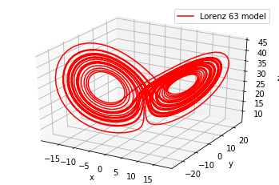
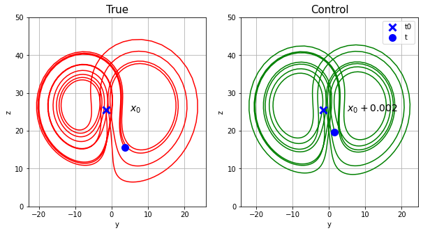
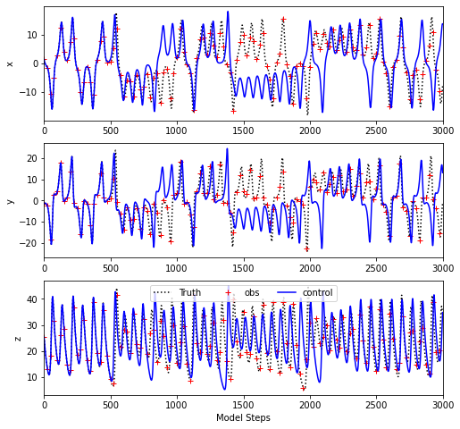
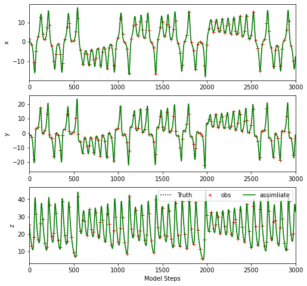
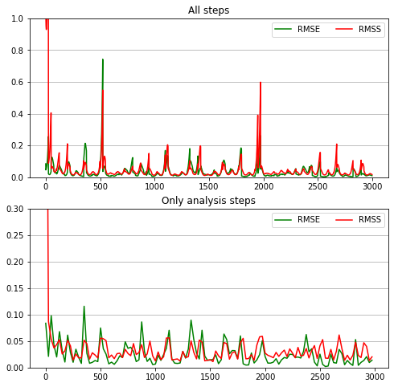

# 洛伦茨63模式中的资料同化实验示例
*沈浙奇 2020.5.21*

zqshen@sio.org.cn

> 工具准备：
编译工具：python
安装使用方式:
1. 下载anaconda: https://www.anaconda.com/products/individual#Downloads
2. 使用Anaconda Prompt 安装numpy和matplotlib两个扩展包, 命令: conda install numpy 和 conda install matplotlib
3. 使用jupyter-notebook可以打开当前文档并运行，将所有代码拷到一个*.py文件也可以在Spyder中运行

在这个实例中，我们使用python实现Lorenz 96模式的集合卡尔曼滤波器同化。
同化的基本思想是使用观测数据对模式的运行状态进行调整。
同化的要素
* 模式
* 观测 
* 同化方法

### 模式
我们首先写一个模式如下：
Lorenz 63模式（Lorenz，1963）
$$\frac{dx}{dt}=\sigma(y-x)$$
$$\frac{dy}{dt}=\rho x-y-xz$$
$$\frac{dz}{dt}=xy-\beta z $$

其中$\sigma$, $\rho$ 和 $\beta$是参数，分别设置为10,28,8/3。
而x,y,z是模式状态变量，在模式中记为矢量$\overrightarrow{x}$的三个元素$x_1$,$x_2$,$x_3$
可以使用数值方法(这里使用最简单的Euler法)求解常微分方程，从初值求得步长$\delta t$后的x状态


```python
def RK45(x,func,h):
    K1=func(x);
    K2=func(x+h/2*K1);
    K3=func(x+h/2*K2);
    K4=func(x+h*K3);
    x1=x+h/6*(K1+2*K2+2*K3+K4);
    return x1

def L63_rhs(x):
    # ODE右端项
    import numpy as np
    dx=np.ones_like(x);
    sigma=10.0; rho=28.0;beta=8/3;   # default parameters
    dx[0]=sigma*(x[1]-x[0])
    dx[1]=rho*x[0]-x[1]-x[0]*x[2];
    dx[2]=x[0]*x[1]-beta*x[2]
    return dx

def L63_adv_1step(x0,delta_t):
    # 使用RK45求解ODE，从初值x0求得步长delta_t后的x状态
    x1=RK45(x0,L63_rhs,delta_t)
    return x1
```

调用 L63_adv_1step 可以积分模式，测试以x0为初值积分5000步，图像如下


```python
import numpy as np
# 模式积分
x0 = np.array([1.508870, -1.531271, 25.46091])
Xtrue = np.zeros([3000,3]);Xtrue[0]=x0
delta_t=0.01
for j in range(1,3000):
    Xtrue[j] = L63_adv_1step(Xtrue[j-1],delta_t)
# 画图    
import matplotlib as mpl
from mpl_toolkits.mplot3d import Axes3D
import numpy as np
import matplotlib.pyplot as plt
mpl.rcParams['legend.fontsize'] = 10
fig = plt.figure()
ax = fig.gca(projection='3d')
ax.plot(Xtrue[:,0], Xtrue[:,1], Xtrue[:,2],'r', label='Lorenz 63 model')
ax.legend()
plt.xlabel('x');plt.ylabel('y');
ax.set_zlabel('z')
```


    Text(0.5, 0, 'z')





Lorenz63模式具有强非线性，即使初值进行微小的扰动，也能对积分的结果造成巨大影响


```python
# 模式积分
x0p = x0+0.002
Xctl = np.zeros([3000,3]);Xctl[0]=x0p
for j in range(1,3000):
    Xctl[j] = L63_adv_1step(Xctl[j-1],delta_t)
# 画图部分    
fig = plt.figure(figsize=(10,5))
plt.subplot(1,2,1)
plt.plot(Xtrue[range(1000),1], Xtrue[range(1000),2],'r', label='Truth')
plt.plot(Xtrue[0,1], Xtrue[0,2],'bx',ms=10,mew=3)
plt.plot(Xtrue[1000,1], Xtrue[1000,2],'bo',ms=10)
plt.ylim(0,50);plt.title('True',fontsize=15);plt.ylabel('z');plt.xlabel('y')
plt.text(5,25,r'$x_0$',fontsize=14)
plt.grid()
plt.subplot(1,2,2)
plt.plot(Xctl[range(1000),1], Xctl[range(1000),2],'g')
plt.plot(Xctl[0,1], Xctl[0,2],'bx',ms=10,mew=3,label='t0')
plt.plot(Xctl[1000,1], Xctl[1000,2],'bo',ms=10,label='t')
plt.ylim(0,50);plt.title('Control',fontsize=15);plt.ylabel('z');plt.xlabel('y')
plt.grid();plt.legend()
plt.text(5,25,r'$x_0+0.002$',fontsize=14)
```


    Text(5, 25, '$x_0+0.002$')





正是在于模式具有这种混沌性质，微小的初始偏差能够造成巨大的预报误差，需要使用同化手段利用现实的观测纠正模式，或者提供更精准的初值。

同化的要素

### 观测资料

为了开展同化实验，我们需要将观测资料同化到模式中去。我们使用孪生实验的方法，使用模拟的数据进行同化实验。我们把前面Truth的结果作为真实值，然后基于真实值取出观测。首先假设我们每25步才能观测一次，同时观测到3个变量。同时观测也具有误差，我们使用高斯分布的随机噪声进行模拟，观测误差的方差设置为0.01。


```python
gap = 25
Y = Xtrue[np.arange(0,3000,gap),:];
Y = Y + 0.1*np.random.randn(3000//gap,3)
R = np.diag([0.01,0.01,0.01])

plt.figure(figsize=(8,8))
Ylabels = ['x','y','z']
for j in range(3):
    plt.subplot(3,1,j+1)
    plt.plot(np.arange(0,3000), Xtrue[:,j],'k:', label='Truth')
    plt.plot(np.arange(0,3000,gap),Y[:,j],'r+',label='obs')
    plt.plot(np.arange(0,3000), Xctl[:,j],'b',label='control')
    plt.xlim(0,3000);plt.ylabel(Ylabels[j])
    if j==2:
        plt.legend(ncol=3);plt.xlabel('Model Steps')

```





**整个同化实验的设计思想是：**
* 我们不知道准确的初值x0，只有它的近似x0p，使用它积分模式很快会因为chaos而失去预报效果。
* 我们对于真实状态的知识只有观测，它在时间（空间）上是不完整的。
* 我们用同化方法得到的结果可以使用Truth进行验证（相当于事件发生后，我们知道了这整段时间的状态演变）

### 同化方法和同化实验

同化流程
1. 使用集合成员，$x_i, i=1,...,N$,每个集合成员是初值x0p的一个近似，我们也使用高斯分布的随机噪声对x0p进行扰动，构造集合
2. 每个集合成员都需要模式积分，到分析时间（有观测的时间），调用EnKF程序进行同化更新
3. 使用同化后的值作为模式积分初值，进行下一步
4. 重复2,3

集合卡尔曼滤波器公式

$$  x_i^a=x_i^{f}+K(y_i-Hx_i^f)$$
$$K=P^TH^T(HP^TH^T+R)^{-1},$$

其中$P$是$x^f$集合的协方差矩阵，$H$是观测算子。在我们的例子中，因为所有变量都能被观测到，$H$可以简化为单位矩阵$I$.

同化循环的实现代码如下：


```python
# In[da]
# to save the DA results
Xassim = np.zeros_like(Xtrue)
Xspread = np.zeros_like(Xtrue)
## Xf 是初始集合 size (N,3) N是集合成员数
N= 100
X0 = np.tile(Y[0],(N,1))+np.random.randn(N,3)
Xf = np.zeros_like(X0)
Xa = np.zeros_like(X0)

Xassim[0]=Y[0]
Xspread[0] = np.std(X0,axis=0)
## 模式积分
for j in range(1,3000):
    for n in range(N):  # 各模式成员积分
        Xf[n] = L63_adv_1step(X0[n],delta_t)
    # DA or pass    
    if j%gap==0: # state data assimilation if encounter observation
        # inflation
        if True:
            inf = 1.0
            Xmean = np.mean(Xf,axis=0)
            for n in range(N):
                Xf[n] = Xmean+inf*(Xf[n]-Xmean)
                
        # data to be assimiated
        obs_idx = j//gap
        y = Y[obs_idx] # the obsevation to be assimilated
        # start the assimilating as follows:
        # ---------------------------------------
        P = np.cov(Xf.T)
        K = np.dot(P.T,np.linalg.inv(P.T+R))
        for n in range(N):
            yn = y+0.1*np.random.randn(3)
            Xa[n] = Xf[n]+np.dot(K,(yn-Xf[n]))
        # ---------------------------------------
        Xf = Xa
    else:
        pass
#    
    Xassim[j] = np.mean(Xf,axis=0)
    Xspread[j] = np.std(Xf,axis=0)
#    
    X0 = Xf
print('finish EnKF assimialte')
```

    finish EnKF assimialte


首先根据平均值查看各变量的同化效果如下: （如果效果不佳, 可试着增大inf）


```python
# In[plt.assim]
plt.figure(figsize=(8,8))
Ylabels = ['x','y','z']
for j in range(3):
    plt.subplot(3,1,j+1)
    plt.plot(np.arange(0,3000), Xtrue[:,j],'k:', label='Truth')
    plt.plot(np.arange(0,3000,gap),Y[:,j],'r+',label='obs')
    plt.plot(np.arange(0,3000), Xassim[:,j],'g',label='assimliate')
    plt.xlim(0,3000);plt.ylabel(Ylabels[j])
    if j==2:
        plt.legend(ncol=3);plt.xlabel('Model Steps')   
```





使用均方根误差以及均方根离散度(spread)评估同化结果


```python
RMSE = np.sqrt(np.mean(np.square(Xtrue-Xassim),axis=1))
RMSS = np.sqrt(np.mean(np.square(Xspread),axis=1))
plt.figure(figsize=(8,8))
plt.subplot(2,1,1)
plt.plot(np.arange(0,3000),RMSE,'g',label='RMSE')
plt.plot(np.arange(0,3000),RMSS,'r',label='RMSS')
plt.grid(axis='y');plt.title('All steps')
plt.ylim(0,1)
plt.legend(ncol=2)
plt.subplot(2,1,2)
plt.plot(np.arange(0,3000,gap),RMSE[np.arange(0,3000,gap)],'g',label='RMSE')
plt.plot(np.arange(0,3000,gap),RMSS[np.arange(0,3000,gap)],'r',label='RMSS')
plt.grid(axis='y');plt.title('Only analysis steps')
plt.ylim(0,0.3)
plt.legend(ncol=2)
```


    <matplotlib.legend.Legend at 0x7f0d6daa0610>





#### 关于EnKF同化的数值讨论

为了实现集合卡尔曼滤波器公式的功能

$$  x_i^a=x_i^{f}+K(y_i-Hx_i^f)$$
$$K=P^TH^T(HP^TH^T+R)^{-1},$$

我们实际上只用了以下5行代码

>         P = np.cov(Xf.T)
        K = np.dot(P.T,np.linalg.inv(P.T+R))
        for n in range(N):
            yn = y+0.1*np.random.randn(3)
            Xa[n] = Xf[n]+np.dot(K,(yn-Xf[n]))
            
这里用到了矩阵求逆的inv算子，这个在数值计算中是大忌：矩阵求逆非常不稳定，且耗非计算资源，在大型模式中难以实现，应该尽可能避免。
因此产生了非常多的变种EnKF，如EnSRF(Houtekamer and Mitchell, 2001), ETKF(Bishop et al.,2001), EAKF (Anderson, 2001)。这些方法在具体公式上都是从上面的EnKF公式演化得到的，在数值实现上有各自的优势和便利性。如占内存少，容易接入新观测，数值稳定，不需要额外扰动观测，便于使用非线性算子等。

这里以EAKF为例，提供分析模块如下,替换同化中的分析部分即可：


```python
def obs_increment_eakf(ensemble, observation, obs_error_var):
    prior_mean = np.mean(ensemble);
    prior_var = np.var(ensemble);
    post_var = 1.0 / (1.0 / prior_var + 1.0 / obs_error_var);
    post_mean = post_var * (prior_mean / prior_var + observation / obs_error_var);

    updated_ensemble = ensemble - prior_mean + post_mean;

    var_ratio = post_var / prior_var;
    updated_ensemble = np.sqrt(var_ratio) * (updated_ensemble - post_mean) + post_mean;

    obs_increments = updated_ensemble - ensemble;
    return obs_increments
# regression the obs_inc to model grid corresponds state_ens
def get_state_increments(state_ens, obs_ens, obs_incs):
    covar = np.cov(state_ens, obs_ens);
    state_incs = obs_incs * covar[0,1]/covar[1,1];
    return state_incs

def eakf_analysis(ensemble_in,obs_in,obs_error_var):
#   no localization for small models
    L = len(ensemble_in);     # model dimension (model grids)
    m = len(obs_in);    # number of obs sites
    for i in range(m):
#        ensemble_proj = np.dot(H_mat,ensemble_in); 
        ensemble_proj = ensemble_in
        obs_proj = ensemble_proj[i];   # project model grid to obs site
        obs_inc = obs_increment_eakf(obs_proj,obs_in[i],obs_error_var);
        for j in range(L):
            state_inc=get_state_increments(ensemble_in[j],obs_proj,obs_inc);

            ensemble_in[j]=ensemble_in[j]+state_inc;
    ensemble_out = ensemble_in;
    return ensemble_out
```


```python
# In[da]
# to save the DA results
Xassim = np.zeros_like(Xtrue)
Xspread = np.zeros_like(Xtrue)
## Xf 是初始集合 size (N,3) N是集合成员数
N= 100
X0 = np.tile(Y[0],(N,1))+np.random.randn(N,3)
Xf = np.zeros_like(X0)
Xa = np.zeros_like(X0)

Xassim[0]=Y[0]
Xspread[0] = np.std(X0,axis=0)

## 模式积分
for j in range(1,3000):
    for n in range(N):  # 各模式成员积分
        Xf[n] = L63_adv_1step(X0[n],delta_t)
    # DA or pass    
    if j%gap==0: # state data assimilation if encounter observation
        # inflation
        if True:
            inf = 1.3
            Xmean = np.mean(Xf,axis=0)
            for n in range(N):
                Xf[n] = Xmean+inf*(Xf[n]-Xmean)
                
        # data to be assimiated
        obs_idx = j//gap
        y = Y[obs_idx] # the obsevation to be assimilated
        # start the assimilating as follows:
        # --------------------------------------
        tmp = eakf_analysis(Xf.T,y,0.01)
        Xa = tmp.T
        # --------------------------------------
        Xf = Xa
    else:
        pass
#    
    Xassim[j] = np.mean(Xf,axis=0)
    Xspread[j] = np.std(Xf,axis=0)
#    
    X0 = Xf
print('finish EAKF assimialte')

# In[plt.assim]
plt.figure(figsize=(8,8))
Ylabels = ['x','y','z']
for j in range(3):
    plt.subplot(3,1,j+1)
    plt.plot(np.arange(0,3000), Xtrue[:,j],'k:', label='Truth')
    plt.plot(np.arange(0,3000,gap),Y[:,j],'r+',label='obs')
    plt.plot(np.arange(0,3000), Xassim[:,j],'g',label='assimliate')
    plt.xlim(0,3000);plt.ylabel(Ylabels[j])
    if j==2:
        plt.legend(ncol=3);plt.xlabel('Model Steps')   
```

    finish EAKF assimialte


#### 讨论
同化的基本实现代码非常简单，但是应用到大型模式会有非常多的技术问题。如前面已经涉及的inflation（协方差膨胀），用于集合spread比较小的情况。在模式较大时，也需要用到localization（局地化）。同化功能的代码量其实非常简单，但是模式复杂性增加时，需要做复杂的模式接口，也需要考虑计算效率。要达到好的同化效果，还需要大量的优化和测试。

下面提供另一个Lorenz 1996模式的代码，作为练习，可以用完全相同的方式构造孪生实验。

Lorenz 96模式的模式方程如下
\begin{equation}
	\frac{dx_j}{dt}=(x_{j+1}-x_{j-2})x_{j-1}-x_j+F,
	\end{equation}


```python
def L96_rhs(x):
    forcing = 8;
    dx=np.ones_like(x);
    L = len(x);
    for i in range(L):
        if i==0:
            dx[i] = (x[i+1]-x[L-2])*x[L-1]-x[i]+forcing;
        elif i==1:
            dx[i] = (x[i+1]-x[L-1])*x[i-1]-x[i]+forcing;
        elif i==L-1:
            dx[i] = (x[0]-x[i-2])*x[i-1]-x[i]+forcing;
        else:
            dx[i] = (x[i+1]-x[i-2])*x[i-1]-x[i]+forcing;
    return dx
def RK45(x,func,h):
    K1=func(x);
    K2=func(x+h/2*K1);
    K3=func(x+h/2*K2);
    K4=func(x+h*K3);
    x1=x+h/6*(K1+2*K2+2*K3+K4);
    return x1
def L96_adv_1step(x0,delta_t):
    x1=RK45(x0,L96_rhs,delta_t)
    return x1
```

#### 引文

1. Anderson, J. L. (2001). An ensemble adjustment Kalman filter for data assimilation. Monthly weather review, 129(12), 2884-2903. 
2. Bishop, C. H., Etherton, B. J., & Majumdar, S. J. (2001). Adaptive sampling with the ensemble transform Kalman filter. Part I: Theoretical aspects. Monthly weather review, 129(3), 420-436. 
3. Houtekamer, P. L., & Mitchell, H. L. (2001). A sequential ensemble Kalman filter for atmospheric data assimilation. Monthly weather review, 129(1), 123-137. 
4. Lorenz, E. N. (1963). Deterministic nonperiodic flow. Journal of the Atmospheric Sciences, 20(2), 130-141. 

