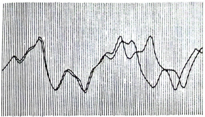
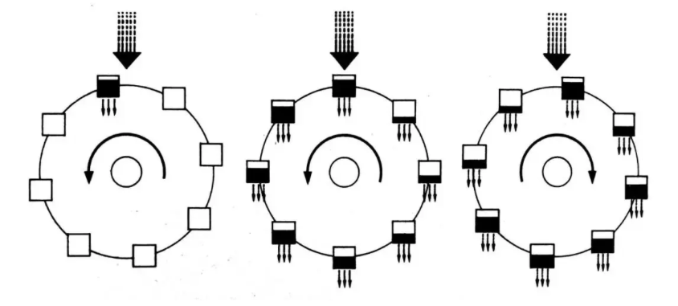
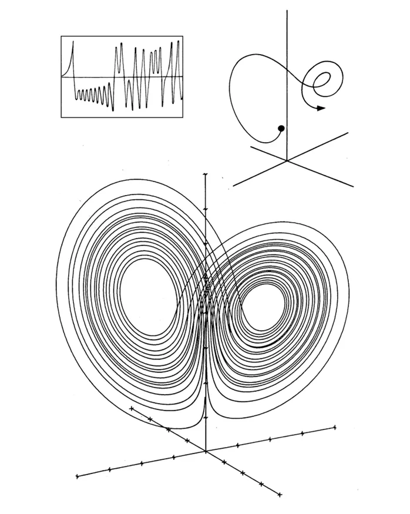

# 混沌：开创一门新科学

阳光穿过一片从不曾出现过云彩的天空。风掠过一块平滑如镜的大地。从不曾有日落月升，从不曾有秋去冬来，也从不曾有水汽的蒸发和凝结。爱德华·洛伦茨的新型电子计算机中的模拟天气缓慢但确定地变化着，游走在一个始终是干燥的、仲秋的、正午的时光当中，就仿佛整个世界已经变成有着完美天气的卡美洛，或者某种特别温和版的南加利福尼亚州。（卡美洛是传说中亚瑟王宫殿的所在地，也比喻充满诗意、天气晴好的地方。-译者注）

在他的窗户之外，洛伦茨能够看到现实的天气，比如晨雾弥漫在麻省理工学院（以下简称MIT）的校园当中，或者，从大西洋飘来的低云掠过屋顶上空。但雾和云从不曾出现在他的计算机所运行的模型中。这部机器-一部皇家-麦克比LGP-30-密布着线路和电子管，醒目地占据了洛伦茨办公室的一大块空间，在运行时发出出人意料、令人心烦的噪声，并且大概每周都会坏一次。它既没有足够的运行速度，也没有足够的内存去真实模拟地球的大气和海洋。但洛伦茨还是在1960年创造出一个天气的玩具模型，成功吸引了他的同事。机器每分钟在纸上打印出一行数字，表明模型里又过了一天。如果你知道如何阅读这些输出，你就会看到一股盛行西风一下偏向北，一下偏向南，然后又偏向北。数字化的气旋在一个理想化的球体上缓慢移动。随着消息在系内传开，其他气象学家会与研究生一道聚集到计算机前，打赌洛伦茨的天气接下去会怎样发展。不知怎的，同样的情形从来不会再次出现。

洛伦茨享受天气。当然，这并不是成为一位气象研究者的先决条件。他欣赏天气的变化无常。他也体味在天气中来来去去的模式，以及种种涡旋族和气旋族，它们始终遵循数学定律，却从来不会重复自己。当他观察云彩时，他以为自己从中看出了一种结构。他曾经担心研究天气的科学会像用螺丝刀拆开玩偶盒那样，最终发现不过如此。而现在他开始怀疑，科学终究能否洞悉天气背后的魔法。天气有着一种无法通过平均数表达的风味。“马萨诸塞州剑桥市六月的平均日最高气温为23.9摄氏度。”“沙特阿拉伯首都利雅得的年平均降水天数为十天。”所有这些都是统计数字。其实质是大气中的模式随时间变化的方式，而这也正是洛伦茨在计算机上所把握到的。

他是这个机器宇宙里的神，得以随心所欲地选择自然定律。在经过一番不怎么神圣的试错后，他选择了十二条定律。它们是一些数值法则-表示气温与气压、气压与风速之间的关系的方程。洛伦茨知道自己是在将牛顿定律付诸实践，而它们是一个钟表匠神明手中的称手工具，借此他可以创造出一个世界，并使之永远运行下去。拜物理定律的决定论所赐，之后的进一步干预会是完全没有必要的。那些创造出这样一些模型的人将这一点视为理所当然，即从现在到未来，运动定律架起了一道具有数学确定性的桥梁。理解了这些定律，你也就理解了整个宇宙。这正是在计算机上为天气建模背后的哲学。

确实，如果18世纪的哲学家将他们的造物主想象为一位仁慈的不干预主义者，满足于隐身幕后，那么他们可能想象的正是像洛伦茨这样一个人。他是一位有点儿另类的气象学家。他有着一副美国农民般的沧桑面孔，出人意料明亮的眼睛让他看上去总是在笑，而不论实际如何。他很少谈论自己或自己的工作，但他会认真聆听。他常常自己沉浸在一个他的同事发现无法进入的计算或梦想的世界当中。他的亲近朋友都觉得，洛伦茨花了大量时间神游宇外。

小时候，他就是一个天气迷，至少到了密切留意最高最低温度计的程度，由此记录下了他父母在康涅狄格州西哈特福德镇的房子外每天的最高和最低气温。但相较于观察温度计，他还是花了更多时间待在室内，做数学谜题。有时候，他会与父亲一起解题。有一次，他们碰到了一个特别难的题目，并最终发现它是无解的。这是可接受的，他的父亲告诉他：你总是可以尝试证明解不存在来解决一个问题。洛伦茨喜欢这一点，因为他向来喜欢数学的纯粹性，而当他在1938年从达特茅斯学院毕业后，他认定数学是自己的志业。然而，造化弄人，在美国加入第二次世界大战后，他应召入伍，成为美国陆军航空兵团的一名天气预报员。在战后，洛伦茨决定留在气象学领域，研究其理论，略微推进其数学。他靠着在诸如大气环流之类的正统问题上发表论文而奠定自己的地位。与此同时，他继续思考着天气预报的问题。

在当时的大多数气象学家看来，天气预报根本称不上一门科学。它只是一种直觉和经验之谈，需要技术人员利用某种直觉能力解读仪器数据和云彩来预测第二天的天气。它不过是猜测。在像MIT这样的学术重镇，气象学青睐那些有解的问题。洛伦茨像其他人一样清楚天气预报的难度，毕竟当初为了帮助军事飞行员，他有过切身经验，但他在这个问题上仍然抱有一种兴趣-种数学上的兴趣。

不仅气象学家鄙弃天气预报，在20世纪60年代，几乎所有严肃的科学家都不信任计算机。这些加强版的计算器看上去根本不像能为理论科学所用的工具。所以数值天气建模看上去并不是一个货真价实的问题。但它的时机已然成熟。天气预报等待了两个世纪，终于等到一种机器能够通过蛮力一再重复成千上万次计算。只有计算机能够兑现这样一种牛顿式许诺，即世界随着一条决定论式的路径前进，像行星那样循规蹈矩，像日月食和潮汐那样可以预测。**在理论上，计算机能够帮助气象学家做到长久以来天文学家利用铅笔和计算尺所能做到的：根据其初始条件以及指导其运行的物理定律，计算出我们宇宙的未来。**而像描述行星运动的方程组一样，描述空气和水的运动的方程组也已经很好地为我们所知。天文学家并没有，也永远不会臻于完美，至少在一个充斥着八大行星、数十个卫星和成千上万个小行星的引力作用的太阳系中不会，但对行星运动的计算如此精确，以至于人们忘了它们只是预测。当天文学家说“哈雷彗星将在七十六年后如此这般回归”时，这听上去就像事实，而非预言。决定论式的数值预测算出了航天器和导弹的精确轨道。为什么这不能用到风和云上面？

**天气要远远更为复杂，但它也受同样的定律支配。**或许一部足够强大的计算机能够成为拉普拉斯-这位18世纪的哲学家兼数学家以及牛顿哲学的热忱支持者所想象的至高智能。“这样一个智能，”拉普拉斯写道，“将在同一个方程中囊括宇宙中上至最大天体，下至最轻原子的运动；在它看来，没有什么是不确定的，而未来，就像过去，将在它的眼前一览无余。”在如今爱因斯坦相对论和海森堡不确定性原理的时代，拉普拉斯的乐观主义使他看上去几近小丑，但现代科学的很大一部分其实一直在追求他的梦想。尽管没有明说，许多20世纪的科学家（生物学家、神经病学家、经济学家等）长久以来所追求的目标一直是，将他们的宇宙分解成将遵循科学定律的最简单原子。在所有这些科学中，他们一直都在运用某种牛顿式决定论。现代计算科学的先驱们也始终心向拉普拉斯，**并且自从约翰·冯·诺伊曼20世纪50年代在新泽西州普林斯顿镇的高等研究院设计出他的第一台计算机以来，计算的历史就与天气预报的历史交织在一起。**冯·诺伊曼意识到，天气建模会是计算机的一项理想任务。

但这里始终存在一个小的妥协，它如此之小，以至于科学家通常会忘记它还在那里，就像一张隐藏在他们哲学的某个角落中的未付账单，测量永远无法做到完美。在牛顿旗帜下前进的科学家实际上挥舞的是另一面大旗，而这面大旗主张的大致是：**给定对于一个系统的初始条件的一个近似知识，以及对于自然定律的一个理解，我们就能够计算出这个系统的近似行为。这个假设存在于科学的哲学核心。**正如一位理论研究者喜欢告诉他的学生：“西方科学的基本思想是，当你尝试解释地球上一张台球桌上的一颗台球的运动时，你不需要将另一个星系里某颗行星上一片落叶的影响考虑进来。**非常微小的影响可以忽略不计。事物运行的方式中存在一种收敛性，任意小的影响不会扩大成为任意大的效应。**”在经典科学中，对于近似和收敛的信念是合理的，因为它确实有效。在1910年为哈雷彗星定位时的一个微小误差只会导致预测它在1986年回归时的一个微小误差，并且这个误差会在将来的数百万年里保持很小的程度。计算机在为航天器导航时正是基于同样的假设：近似精确的输入会给出近似精确的输出。经济预测也是基于这个假设，尽管其成功的程度并没有那么显著。全球天气预报的先驱们也是如此。

在他的原始计算机上，洛伦茨将天气化约为它的最简单形式。尽管如此，计算机的一行行输出里的风和温度看上去隐约表现得仿佛现实中的天气一般。它们契合洛伦茨有关天气的宝贵直觉，符合他的感知，即天气会重复自己，随着时间的推移展现出相似的模式，比如气压起起伏伏，气流偏南偏北。他发现，当一条曲线从高走到低，中间没有出现一个隆起时，接下来一个双隆起就会出现，而“这是一种天气预报员可以使用的规律”。但重复永远不会是完全一样的。这是一种存在扰动的模式，一种有序的无序。

为了让模式清晰可见，洛伦茨创造出一种原始的作图法。他不再让计算机输出通常的一行行数字，而是让机器打印出字母a，然后在后面接续特定数量的空格。他会挑选一个变量-或许是气流的方向。然后慢慢地，一个个a就会在卷纸上相继出现。它们间隔不等，来回摆动，形成一条波状曲线，其中的一系列峰和谷就代表西风在大陆上的南北摆动。这当中的有序性，这些一再出现但没有两次完全相同的可辨识的循环，无疑具有一种迷人的吸引力。整个系统看上去正在慢慢向天气预报员吐露自己的秘密。

在1961年冬的一天，为了仔细检视一大段他感兴趣的序列，洛伦茨抄了一次近道。他没有重新开始整个运行，而是从中间切入，将之前输出的数输入计算机，作为后续运行的初始条件。然后他来到走廊以躲开噪声，并喝上一杯咖啡。当他在一个小时后回到办公室时，他看到了某种意料之外的东西，某种将种下一门新科学的种子的东西。

这次新的运行原本应该与旧的一模一样。数是洛伦茨自己输入的。程序也没有变动。但当他检视新的输出时，洛伦茨发现，他的天气如此之快地偏离了上一次运行的模式，以至于在短短几个月里，原有的相似性完全消失不见。他看看一组数，回头再看看另一组。它们就仿佛是他在随机挑选时会选出的两个天气。他的头一个念头是，又一个电子管坏了。

然后他突然明白了过来。机器并没有出故障。问题在于他当初输入的数。在计算机的内存中，数值以六位小数的形式存储：0.506 127。而在输出中，为了节省空间，计算机只显示三位小数：0.506。洛伦茨当初输入的是四舍五入后更短的数，他以为这个千分之一的差异无关紧要。

这是一个合理的假设。如果一颗气象卫星能够以千分之一的精度监测海面温度，其操作员就应该感到谢天谢地了。洛伦茨的计算机运行的是经典科学程序，其中用到的是一个完全决定论式的方程组。给定一个特定的起始点，每次运行，天气都会以完全一样的方式展开。给定一个略微不同的起始点，天气也应该以略微不同的方式展开。一个小的数值误差就像一小股风-无疑这些小股风会自行消散或相互抵消，而不会改变天气在大尺度上的重要特征。**但在洛伦茨的这个方程组中，小的误差被证明会引发灾难性后果。**

>  ©Edward N. Lorenz/Adolph E. Brotman
>
>  两个天气模式如何发生偏离。爱德华·洛伦茨看到，从几乎一样的起始点出发，他的计算机天气模型生成了两个模式，并且随着时间的推移，它们的差别越来越大，直到原有的相似性完全消失不见。（来自洛伦茨1961年的输出。）

他决定更仔细地看一下两次几乎相同的运行是如何分道扬镳的。他将输出的一条波状曲线复制到一张透明投影片上，然后将它重叠到另一份输出上，以检视偏离是如何发生的。在一开始的前两个“驼峰”上，两条曲线几乎若合符节。然后一条曲线开始稍微落后。等到下一个“驼峰”出现，两次运行已经明显错开了。到了第三或第四个“驼峰”，所有的相似性都已经消失不见了。

这只是从一部笨拙的计算机上所得到的偏差。洛伦茨原本可以假设，是他的这部机器或这个模型哪里出了问题--很有可能他也原本应该如此假设。毕竟这不像是说他当初混合钠和氯而得到了金子。但出于某种他的同事只有在后来才开始理解的数学直觉，洛伦茨有了一种感觉：是哲学上哪里出了问题。而其实践意涵也会非常惊人。尽管他的方程组是对于地球上的天气的拙劣戏仿，但他还是有信心，认为这些方程组把握到了现实大气的实质。在第一天，他就认定，**长期天气预报必定是不可能的。**

“在这一点上，我们无疑一直没有取得成功，而现在我们有了一个借口，”洛伦茨说道，“我想，之所以人们认为对如此远期的天气进行预报会有可能做到，原因之一是存在一些我们能够做出很好预测的现实物理现象，比如日月食（其中太阳、月亮和地球的动力学是相当复杂的），又如潮汐。我过去从没有将潮汐预报视为预测（我过去一直将它们视为陈述事实），但当然，这是在预测。潮汐实际上与大气一样复杂。两者都具有周期性构成-你可以预测说，下一个夏季会比这个冬季更暖和。但对于天气，我们采取的态度是，这一点众所周知，不值一提。对于潮汐，这个可预测的部分却正是我们感兴趣的，而其不可预测的部分是很小的，除非出现了一场风暴。

“在看到我们能够提前几个月预报潮汐后，一般人可能会说，为什么我们不能对大气做同样的事情，毕竟它不过是另一个流体系统，受到差不多同样复杂的定律支配。但我现在意识到，任何表现出非周期性的物理系统都会是不可预测的。”

在 20 世纪五六十年代，到处弥漫着对于天气预报的不切实际的乐观主义情绪。报纸和杂志上充斥着对于气象科学的冀望，不只是天气预报，还有人工影响天气和天气控制。有两种技术正在日渐成熟，那就是电子计算机和人造卫星。而一项称为全球大气研究计划的国际合作项目也正在准备充分利用它们。当时的一种思想是，人类社会将从天气的变化无常中解放出来，从其受害者摇身变成其主人。短程线穹顶将罩住玉米地。飞机将直接往云中播散催化剂。科学家将学会如何造雨和止雨。

这种思潮的思想之父是冯·诺伊曼，他在设计自己的第一部计算机时所意图的功能之一就是控制天气。他召集了一帮气象学家，并向一般科学界宣传他的计划。对于自己的乐观主义，他有一个数学上的具体理由。他注意到，一个复杂的动力系统可以具有一些不稳定点——一些临界点，在那里，轻轻一推就会引发重大后果，就像轻推山顶上的球一样。而冯·诺伊曼设想，有了计算机的帮助，科学家就能够计算出流体运动的方程组在接下来几天的行为。然后一个由气象学家构成的中央委员会将派遣飞机去播散烟幕或播云，从而将天气推向想要的方向。但冯·诺伊曼忽视了混沌的可能性，而到时每一点都将是不稳定的。

到了 20 世纪 80 年代，专门有一个庞大的机构不惜耗费巨资去追求冯·诺伊曼的目标，至少是其中的天气预报部分。在马里兰州郊区（靠近华盛顿环路）的一栋外表朴素、屋顶布满雷达和无线电天线的方盒子建筑里，美国的顶尖天气预报员济济一堂。他们的超级计算机所运行的天气模型与洛伦茨的只在最基本的精神上相似。相较于皇家–麦克比 LGP - 30 能够每秒进行六十次乘法运算，一部 CDC Cyber 205 大型机的威力以每秒百万次浮点运算计。**而相较于洛伦茨满足于十二个方程，现代的全球天气模型处理的是包含500,000个方程的系统。**他们的模型理解随着空气收缩和膨胀，水汽释放和吸收热量的方式。数字化的风会受到数字化的山脉的影响。而每个小时，来自全球各个国家的数据，来自飞机、卫星、船舶的数据会汇集到这里。美国国家气象中心生产出了世界上第二好的天气预报。

最好的天气预报则出自英格兰的雷丁镇，一个距离伦敦一小时车程的大学小镇。欧洲中期天气预报中心坐落在一处树木掩映的建筑当中，这是一栋有着联合国风格的现代砖和玻璃建筑，里面还摆放着各地赠送的礼物。它是欧洲共同市场精神全盛之时的产物，当时大多数西欧国家决定汇集各自的人才和资源，以求做出更精准的天气预报。欧洲人将他们的成功归结为他们轮转的年轻才俊（没有公务员）以及他们的克雷超级计算机（似乎总是比美国人所用的计算机先进一个型号）。

天气预报标志着利用计算机为复杂系统建模的开始，但无疑这不是其结束。同样的技术也帮助了其他许多领域的科学家和社会科学家做出预测，从推进器设计师关心的小规模流体流，到经济学家关心的大规模金融流，不一而足。事实上，到了 20 世纪七八十年代，利用计算机进行经济预测已经变得与全球天气预报非常相像了。**各种模型会穿行在由方程组构成的复杂但不无武断的网络中，通过它们将对于初始条件（不论是大气压，还是货币供应）的测量转化为对于未来趋势的一个模拟。**研究者希望，结果不会由于许多不可避免的简化假设而太过偏离现实。如果一个模型确实得出了某个明显离谱的结果（比如撒哈拉发洪水，或者利率涨三倍），研究者就会调整方程组，以便使结果重归正轨。在实践中，经济模型屡屡被证明难以对未来做出可靠的预测，但仍有许多人，他们原本应该更清楚这一点，却表现得仿佛他们对这些结果深信不疑。经济增长率或失业率的预测在被提出时，常常暗示人们自己精确到了两位或三位小数。而政府和金融机构往往会为这样一些预测买单，并在它们的基础上采取行动，这或许是出于必要或缺乏其他更好选择。也许他们清楚，像“消费者信心”这样的变量，并不像“湿度”那样能够得到很好的测量，而对于政治和时尚的变化，我们也还没有找到能够完美刻画它们的微分方程组。但很少有人意识到，**在计算机上为各种流建模的这个过程本身有多么脆弱，哪怕数据是相当可靠的，而支配它们的定律，就像在天气预报中那样，是纯粹物理的**。

计算机建模确实已经成功将天气预报从一门艺术变成了一门科学。欧洲中期天气预报中心的评估表明，靠着这些从统计上看聊胜于无的预测，世界每年得以减少数十亿美元的损失。但超过两三天，即便世界上最好的天气预报也不过是猜测；而超过六七天，它们则变得毫无价值。

蝴蝶效应正是个中缘由。对于小尺度天气现象（在一个全球天气预报员看来，“小尺度”可能意味着雷暴和雪暴），任何预测都会快速恶化而变得没用。**误差和不确定性不断积累，在一系列大小不同的湍流现象（从尘卷风和飑，到只能透过人造卫星看到的巨大涡旋）中不断放大。**

现代的全球天气模型使用的是从一个格点之间相距一百公里的网格中采样的数据，而即便如此，某些初始数据还是需要靠猜测得到，因为地面站和人造卫星无法每个地方都观测到。但不妨设想整个地球可以布满传感器，它们水平间隔三十厘米，垂直间隔三十厘米，往上直到大气层顶部。再设想每个传感器可以给出有关温度、气压、湿度，以及气象学家想了解的其他任何物理量的完全精确的读数。然后在正午时分，一部无限强大的计算机读取所有这些数据，并计算接下来每分钟（12:01, 12:02, 12:03,…）的天气状况。

到时，计算机将仍然预测不出在一个月后的某天，新泽西州普林斯顿镇是晴天，还是下雨。在正午时分，位于传感器之间的空间会存在不为计算机所知的随机涨落，即对于平均值的微小偏离。到了12:01，这些涨落会在三十厘米之外创造出微小的误差。这些误差很快会在三米的尺度上不断积累，如此这般，直到在整个地球的尺度上导致显著的差异。

即便对于资深气象学家来说，所有这些也有违直觉。洛伦茨的一位老朋友是 MIT 的气象学家罗伯特·怀特，后者后来成为美国国家海洋和大气管理局的首任局长。洛伦茨向他说明了蝴蝶效应，以及他觉得这对长期预测来说可能意味着什么。怀特给出了冯·诺伊曼的回答。“预测，无关紧要，”他说道，“这是天气控制。”他的想法是，在人力所及范围内的小的人工影响将能够引致我们想要的大尺度上的天气变化。

洛伦茨则认为不然。确实，你能够改变天气。你能够使之变成不同于原本的另一副模样。但如果你这样做了，你就永远无法知道它原本会是什么模样。这就像是把一副已经洗匀的扑克牌再洗一次。你知道这会让你改变运气，**但你不知道运气会是变好，还是变坏**。

洛伦茨的发现是一个意外，是自阿基米德及其浴缸以来的无数意外发现中的一个。洛伦茨向来不是那种大呼“尤里卡”的类型。这个意外发现只是将他引到了一个他从未曾离开的地方。他准备通过找出它对于科学理解各种流体流的方式究竟意味着什么，深入探索这个发现的意涵。

要是他当初止步于蝴蝶效应，一个说明可预测性让步于完全随机性的意象，那么洛伦茨原本可能揭示的不过只是一个非常坏的消息。**但洛伦茨在他的天气模型中看到的不只是随机性。他看到了一个精细几何结构，一种乔装成随机性的秩序。**毕竟他是一位乔装成气象学家的数学家，而这时，他开始过上一种双面生活。他会写作纯粹气象学的论文。但他也会写作纯粹数学的论文，只是还以有点儿略微误导人的天气话题作为开场白。最终，这样的开场白也会彻底消失不见。

他将注意力越来越多地转向这样一些系统的数学，这些系统始终无法找到一个定态，几乎要重复自己，但始终没有完全做到。每个人都知道，天气就是这样一个系统——非周期的。其他类似例子在大自然中所在皆是：几乎规则起伏的动物种群数量，以接近定期的时间表爆发和消退的流行病，如此等等。要是天气确实有朝一日来到了一个与它之前经历过的某个状态确切一样的状态，每股风和每片云都一模一样，那么有可能它会接下来永远重复自己，这时天气预报的问题就会变得平凡无奇。

洛伦茨意识到，在天气不愿意重复自己与天气预报员无法预测它之间必定存在一种关联——**一种在非周期性与不可预测性之间的关联**。找到会生成他所寻觅的非周期性的简单方程组并不是件易事。一开始，他的计算机模型倾向于陷入始终重复的循环。但洛伦茨尝试了各式各样的略微复杂化，并最终在加入一个东西方向上的温差（对应于在现实世界中，比如北美东海岸与大西洋在受热升温上的差异）随时间变化的方程后取得了成功。重复消失不见了。

**蝴蝶效应其实并不是一个意外，而是一种必需**。洛伦茨推理，设想小的扰动不是在系统中积累扩大，而是维持这么小的状态，那么当天气变得任意接近一个它之前经历过的状态时，它就会维持这个样子，接下来继续任意接近该状态。实际上，这样的循环会是可预测的——因而最终也是无趣的。为了生成地球上丰富多彩、变化万端的现实天气，你大概想象不出比蝴蝶效应更好的东西了。

蝴蝶效应也被冠以另一个技术性名称：**对初始条件的敏感依赖**。而对初始条件的敏感依赖其实并不是一个全新概念。它在民间故事中就有体现：

少了一钉子，失了一铁蹄；少了一铁蹄，失了一战马；少了一战马，失了一骑士；少了一骑士，失了一胜仗；少了一胜仗，失了一王国。

像在生活中一样，在科学中，众所周知，一连串事件中可以有一个激变点，将小的变化放大。但混沌意味着，这样的点到处都是。它们无处不在。在像天气这样的系统中，对初始条件的敏感依赖是小尺度与大尺度交织在一起的方式的一个不可避免的结果。

他的同事惊喜于洛伦茨同时把握到了非周期性和对初始条件的敏感依赖，而他所用的只是一个天气的玩具模型：十二个方程，然后凭借机械的高效率一遍遍加以计算。那么这样的丰富性、这样的不可预测性（这样的混沌），如何能够从一个简单的决定论式系统中冒出来？

洛伦茨暂时放下天气，试图找到比它还要更简单的方式去生成这种复杂的行为。最终他在一个只由三个方程构成的系统中找到了这样的方式。这些方程是非线性的，也就是说，它们所表示的关系不是严格成比例的。线性关系可被表示为图上的一条直线。它理解起来也很容易：多多益善。线性方程组是可解的，而这使得它们适合进入教科书。线性系统还具有一个重要的构件化优点：你可以把它们拆开，然后再把它们组装到一起-其各部分是可加的。

非线性系统则一般是不可解和不可加的。**在流体系统和力学系统中，非线性的项往往是人们在试图得到一个简单明了的理解时希望加以忽略的一些特征。**比如，摩擦力。在没有摩擦力的情况下，加速一枚冰球所需的能量可用一个简单的线性方程表示出来。而在有摩擦力的情况下，关系变得更为复杂，因为所需的能量取决于冰球已有的运动速度。**非线性意味着，参与游戏的行为本身会改变游戏规则。**你无法赋予摩擦力一个恒定的重要性，因为其重要性取决于速度。而速度，反过来，又取决于摩擦力。这种相互依赖使得非线性难以计算，但它也创造出了丰富多彩的、不见于线性系统的各类行为。在流体动力学中，一切都可以归结到一个经典方程——纳维–斯托克斯方程。这是一个简洁性的奇迹，将流体的速度、压强、密度和黏度联系到了一起，但它碰巧是非线性的。所以这些关系的性质常常变得不可能明确确定。分析一个像纳维–斯托克斯方程这样的非线性方程的行为，就仿佛是穿行在一个迷宫当中，并且其墙壁会随着你的每一步而发生重新排列。就像冯·诺伊曼自己所说的：“方程的特性……在所有相关层面上都同时发生改变：次数和度都发生改变。因此，棘手的数学难题必定随之而来。”要是纳维–斯托克斯方程里不包含非线性的魔鬼，那么世界会变得大不相同，科学也会不需要混沌。

**洛伦茨的三个方程受到了一类特定的流体运动的启发：热的气体或液体的上升，即对流。**在大气中，靠近地面的空气受热膨胀上升；在热的沥青和散热器表面，热气升腾，氤氲似鬼魅。洛伦茨也乐于谈论一杯热咖啡中的对流。按照他的说法，这只是我们可能希望预测其未来的不可计数的流体动力过程中的一种。我们如何能够计算出一杯咖啡会冷却得多快？如果咖啡只是温的，那么不需要任何流体动力运动，其热量也会慢慢耗散。这时咖啡维持在一个定态。但如果它足够热，对流过程就会将热咖啡从杯底带到温度较低的杯面。只需在杯中加入些许稀奶油，咖啡中的对流便会变得清晰可见。由此产生的白色涡旋可以非常复杂。但这样一个系统的长期命运是显而易见的。由于热量不断耗散，也由于摩擦力减缓了流体的速度，整个运动必定最终不可避免会停止。洛伦茨便对着一帮科学家一本正经地开玩笑道：“我们可能难以预报咖啡在一分钟后的温度，但我们应该不难预报它在一小时后的温度。”刻画一杯慢慢冷却的咖啡的运动方程组必须要能够反映系统的这种命运。它们必定要是耗散的。咖啡的温度必定要逐渐趋于室温，而速度必定要趋于零。

洛伦茨选取了一组描述对流的方程，并极力简化，舍弃一切有可能出错的东西，使之简单到脱离现实。原始模型几乎一点儿影子都没有剩下，但他的确将非线性保留了下来。在物理学家的眼中，这些方程看上去甚是简单。你会扫上一眼（后来的许多科学家确实就是如此），然后说：“我能够求解它。”

“确实，”洛伦茨平静地说道，“当你看到它们时，你会倾向于这样想。它们当中存在一些非线性的项，但你认为必定存在某种方式可以绕过它们。但你就是无法做到。”

最简单的教科书式对流出现在一个充满流体的盒子中，盒子的一个平滑底面可被加热，而另一个平滑顶面可被冷却。热的底部与冷的顶部之间的温差控制着流体流的运动。如果温差很小，那么整个系统保持静止。这时热量通过热传导从底部流向顶部，就仿佛流经一块金属，不足以克服流体宏观上维持不动的自然倾向。此外，整个系统是稳定的。任何随机运动（比如一个研究生敲击实验设备所引发的）会慢慢消失，使系统回归其定态。

>  ©Adolph E. Brotman

>  **翻滚的流体：**当一种液体或气体在底部受热时，该流体倾向于自组织形成一个个圆柱状的涡卷（左图）。热流体在一边上升，逐渐失去热量，然后在另一边下沉——这就是对流过程。进一步加热后（右图），一种不稳定性开始出现，涡卷开始沿着圆柱体的长轴前后摆动。在更高的温度上，流体流变得恣意和紊乱。

但增大加热强度，新的一类行为就会出现。随着底部的流体受热，它体积膨胀。随着它体积膨胀，它密度变小。而随着它密度变小，它相对变轻，足以克服摩擦力，从而上升至顶部。在一个小心设计过的盒子中，圆柱状的涡卷会出现，其中一边是热流体受热上升，另一边则是冷流体下沉补充。从侧面看，整个运动构成了一个连续的圆。而在实验室之外，大自然也经常创造出它自己的对流涡胞。比如，当太阳加热沙漠的地表时，翻滚的气流会在上面的积云或下面的沙堆中创造出神秘莫测的模式。

进一步增大加热强度，流体的行为会变得更为复杂。涡卷会开始扭曲、摆动。洛伦茨的方程组太过简化，完全不足以为这类复杂性建模。它们所抽象的只是现实世界对流的一个特征：热流体上升而冷流体下沉、翻滚仿似摩天轮的圆周运动。这些方程考虑了这种运动的速度以及热量的传递，而这些物理过程是相互作用的。随着热流体沿着圆上升，它会与其他较冷的部分相接触，从而开始失去热量。如果运动的速度足够快，那么底部流体在抵达顶部并开始顺着涡卷的另一边下沉时不会失去所有的额外热量，所以它实际上会开始阻碍处在身后的其他热流体的运动。

尽管洛伦茨的系统没有为对流完全建模，但事实证明，它还是能在现实系统中找到一些确切的对应物。比如，他的方程组就精确描述了一种老式发电机。作为现代发电机的祖先，圆盘发电机通过圆盘在磁场中转动而生成电流。在特定条件下，一种双圆盘发电机能够反转线路中的电流。在洛伦茨的方程组变得为更多人所知后，有些科学家就提出，这样一种发电机的行为或许可以解释另一种怪异的反转现象：地磁场。人们已经知道，在地球的历史上，这种“地磁发电机”已经反转过很多次，并且这些反转之间的间隔看上去毫无规则、难以解释。面对这样的不规则性，理论研究者通常试图在系统之外寻找解释，提出诸如陨石撞击之类的理由。但或许地磁发电机自有其混沌。

另一个可被洛伦茨的方程组精确描述的系统是某种水车，这是对流的圆周运动的一个力学类比。在顶部，水匀速流入挂在水车边缘的水斗中。每个水斗则透过底下的一个小孔匀速将水漏出。如果水流缓慢，那么最高处的水斗将永远无法积累足够多的水，不足以克服摩擦力；但如果水流变快，最高处的水斗的重量将带动水车开始转动。转动可能持续朝同一个方向。或者如果水流如此之快，以至于重的水斗越过最低点来到另一边，于是整个水车可能变慢、停止，然后反向转动，一下朝一个方向，一下朝另一个方向。

面对这样一个简单的力学系统，物理学家的直觉（其前混沌的直觉）会告诉他，长期来看，如果水流保持匀速，一个定态就将会演化出来。要么水车匀速转动，要么它稳定地来回振荡，以恒定的间隔一下朝一个方向，一下朝另一个方向。但洛伦茨发现情况并非如此。

>  ©Adolph E. Brotman
>
> **洛伦茨的水车：**由爱德华·洛伦茨发现的第一个著名的混沌系统确切对应于一个力学装置：一部水车。这个简单的装置被证明能够生成出人意料复杂的行为。
>
> 水车的转动具有一些与对流过程中流体形成的翻滚圆柱体相似的属性。水车就像圆柱体的一个横截面。两个系统都被匀速驱动（被水或热量），并且两者都耗散能量（流体失热，而水斗漏水）。在两个系统中，长期行为都取决于驱动能量的强弱。水从顶部匀速流入。如果水流缓慢，最高处的水斗永远无法积累足够多的水，不足以克服摩擦力，整个水车就不会开始转动。（类似地，在流体中，如果热量不够多，不足以克服黏性，流体也不会开始运动。）如果水流变快，最高处的水斗的重量将带动水车开始转动（左图）。整个水车会进入一个朝同一个方向的匀速转动（中间图）。但如果水流变得更快（右图），由于系统内禀的非线性效应，转动会变得混沌。随着水斗经过水流下方，它们能够承接的水量取决于转动的速度。一方面，如果水车转得很快，水斗就没有多少时间接水。（类似地，处在快速翻滚的对流中的流体也没有多少时间吸收热量。）另一方面，如果水车转得很快，水斗会在水漏光之前来到另一边。因此，在另一边向上运动的重的水斗会导致转动变慢，乃至反转。事实上，洛伦茨发现，长期来看，转动会多次反转，并且从不会出现一个稳定的频率，也从不会以任何可预测的模式重复自己。

三个方程（连同其三个变量）完全描述了这个系统的运动。洛伦茨的计算机输出了这三个变量不断变化的值：0–10–0, 4–12–0, 9–20–0, 16–36–2,　30–66–7, 54–115–24, 93–192–74。随着系统中时间的推移，五个时间单位，一百个，一千个，这些数起起伏伏。

为了利用数据得到一个直观图像，洛伦茨以每组的三个数为坐标，确定三维空间中的一个点。由此，数的序列生成了一个点的序列，一条记录下这个系统行为的连续的轨线。这样一条轨线可能来到一个地方，然后终止，意味着系统最终进入一个定态，届时有关速度和温度的变量将不再变化。或者轨线可能构成一个环，循环往复，意味着系统最终进入一个周期性重复自己的行为模式。

洛伦茨的系统不属于这两种情况。相反，**它的图像展现出一种无穷的复杂性。**它始终停留在特定边界之内，不越雷池一步，但也始终没有重复自己。它生成了一个怪异而独特的形状——某种三维空间中的双螺线，就好似伸展双翅的一只蝴蝶。这个形状透露出纯粹的无序，因为其中没有哪个点或点的模式是重复的。但它也透露出一种新的类型的秩序。

多年以后，物理学家会眼带向往之情地谈论起洛伦茨那篇讨论这些方程的论文——“那篇美丽的杰作”。到那时，它被人说得就仿佛是一份古代卷轴，内含有关永恒的天机。在成千上万的讨论混沌的技术性文献中，几乎没有哪篇论文比《决定论式的非周期性流》一文更常被人引用。在很多年里，也没有哪一个对象会比该论文中所刻画的那条神秘曲线，即后来被称为洛伦茨吸引子的双螺线，启发、催生出更多插图，乃至动画。**有史以来第一次，洛伦茨的图像得以向我们清楚展示，说“这很复杂”究竟意味着什么。**混沌的所有丰富意涵都在那里面。

> ©James P. Crutchfield / Adolph E. Brotman
>
> **洛伦茨吸引子：**这个类似猫头鹰面具或蝴蝶双翅的神奇图像，成了混沌的早期探索者的一个象征。它揭示出了隐藏在一股无序的数据流背后的精细结构。传统上，一个变量的不断变化的值可表示为一个所谓的时间序列（左上图）。但要想展示三个变量之间不断变化的关系，这需要用到一种不同的技术。在任意一个给定时刻，三个变量的值确定了三维空间中一个点的位置；而随着系统变化，这个点的运动就代表了这些不断变化的变量。由于系统永远不会确切重复自己，因此其轨迹永远不会自相交。相反，它始终在绕来绕去。吸引子的运动是抽象的，但它还是传递出了现实系统运动的某些特征。比如，从吸引子的一翼跃至另一翼就对应于水车或对流流体的运动方向的反转。

不过，在当时，几乎没有人能看出这一点。洛伦茨曾向威廉·马尔库斯（一位MIT的应用数学教授，也是一位彬彬有礼的科学家，对于同仁的工作有着非凡的赏识能力）描述了自己的发现。马尔库斯听完笑了起来：“埃德，我们知道（我们清楚地知道），流体的对流根本不会出现那种情况。”马尔库斯告诉他，复杂性无疑会慢慢削弱，系统最终将趋于稳定而规则的运动。

“当然，我们当时完全没有把握到重点，”马尔库斯在二十多年后（即在他曾在自己的地下室实验室里实际搭起一部洛伦茨水车，以便向非信仰者“传道”的多年之后）说道，“埃德当时所思考的根本不是我们的物理学。他所思考的是某种一般化的或抽象的模型，而其展现出来的行为，他出于本能感到，是外部世界的某些层面的典型行为，不过他无法跟我们这样说。只是在事后，我们才意识到他当初必定是这样一些观点。”

**当时很少有外行人意识到，科学界已经变得多么相互隔绝；它就犹如一艘战舰，其中一道道水密舱壁使各舱室相互隔绝，密不透水。**生物学家不需要再关注数学文献，也已经有足够多的东西需要阅读——事实上，分子生物学家不需要再关注种群生物学，也已经有足够多的东西需要阅读。物理学家也有比浏览气象学期刊更好的方式去花费自己宝贵的时间。原本有些数学家会兴奋于看到洛伦茨的发现；而在接下来的十年里，也有许多物理学家、天文学家和生物学家一直在寻找像这样的东西，并且有时他们还自己重新发现了它。但洛伦茨是一位气象学家，而当时没有人想到要去《大气科学期刊》第20卷的第103页找寻混沌。

《混沌》（人民邮电出版社2021版）第一章

